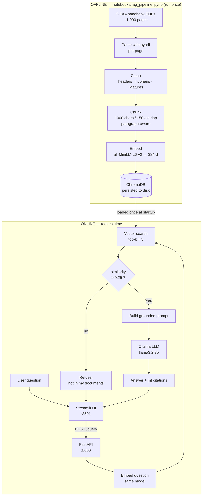
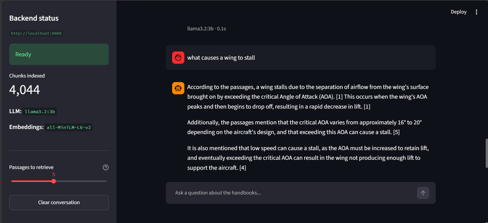
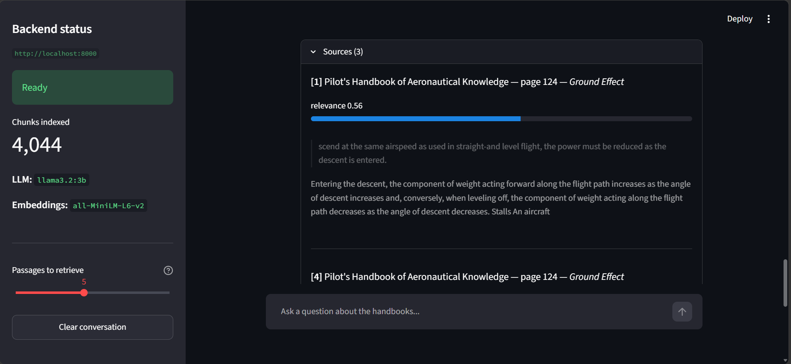
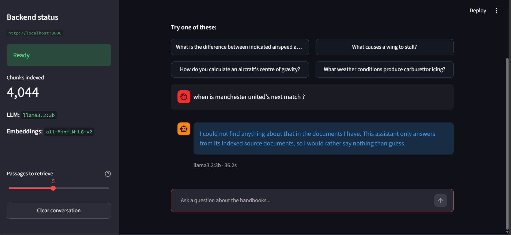
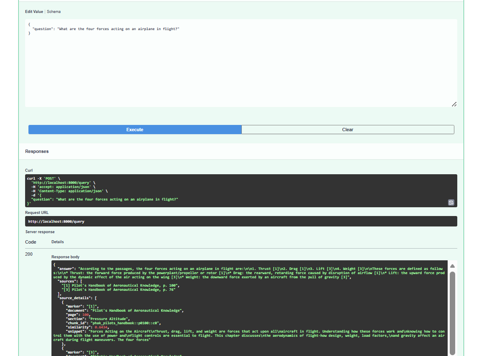

# ✈ Aviation Handbook Assistant — RAG-Powered Document Assistant

A complete Retrieval-Augmented Generation application: **5 FAA aviation handbooks → cleaned → chunked → embedded → ChromaDB → FastAPI → Streamlit chat UI**, running entirely on your own machine with a local Ollama LLM.

Every answer is generated **only** from passages retrieved out of the source documents, and carries `[n]` citations back to the exact handbook and page — so any claim can be checked.

> **Level 2 Summer Training · Graduation Project · Core Track**

---

## Table of contents

- [What it does](#what-it-does)
- [Architecture](#architecture)
- [Tech stack](#tech-stack)
- [Project structure](#project-structure)
- [The domain & data](#the-domain--data)
- [Setup](#setup)
- [Environment variables](#environment-variables)
- [API reference](#api-reference)
- [Evaluation results](#evaluation-results)
- [Screenshots](#screenshots)
- [Design decisions](#design-decisions)
- [Known limitations](#known-limitations)

---

## What it does

Ask a question in plain English:

> *"What causes a wing to stall?"*

The system then:

1. **Embeds** your question into a 384-dimensional vector.
2. **Searches** ~4,000 indexed passages for the closest matches by cosine similarity.
3. **Discards** anything below a relevance floor — if nothing clears it, the assistant says *"I don't know"* rather than guessing.
4. **Builds a prompt** containing only the surviving passages, numbered `[1]…[5]`.
5. **Asks a local LLM** to answer using only those passages, citing each fact.
6. **Returns** the answer plus the document, page and relevance score of every source it used.

The point of steps 3 and 6 is that this assistant **cannot** quietly answer from the language model's own memory. That is the difference between a RAG system and a chatbot.

---

## Architecture



**The key structural idea:** all the expensive work — parsing, chunking, embedding — happens **once**, offline, in the notebook. The backend loads the finished index at startup and never rebuilds it. That is what keeps a query at roughly *200 ms of retrieval* rather than several minutes.

---

## Tech stack

| Layer | Choice | Why |
|---|---|---|
| PDF parsing | `pypdf` | Pure Python, no system dependencies, handles the FAA text layer well |
| Chunking | Custom, paragraph-aware | Section-heading metadata makes citations readable; see [notebook §2.2](notebooks/rag_pipeline.ipynb) |
| Embeddings | `all-MiniLM-L6-v2` (384-d) | 90 MB, CPU-fast, strong quality per byte |
| Vector DB | **ChromaDB** (persistent, cosine) | Zero-config, embedded, saves straight to disk |
| LLM | **Ollama** + `llama3.2:3b` | Runs locally, free, no API key |
| API | **FastAPI** + Pydantic v2 | Automatic validation and OpenAPI docs |
| Frontend | **Streamlit** | Chat UI in pure Python |
| Tests | `pytest` + `TestClient` | 9 tests, run in <1 s with no ML stack needed |

---

## Project structure

```
rag-assistant-app/
├── notebooks/
│   └── rag_pipeline.ipynb        # Phase 2: the whole offline pipeline + evaluation
├── scripts/
│   └── download_corpus.py        # Reproducibly fetches the 5 source PDFs
├── data/raw/                     # Downloaded PDFs (gitignored)
├── reports/                      # Evaluation output written by the notebook
├── backend/
│   ├── app/
│   │   ├── main.py               # FastAPI app, CORS, startup loading
│   │   ├── api/routes/query.py   # GET /health, POST /query
│   │   ├── core/config.py        # Settings from .env
│   │   ├── schemas/query.py      # QueryRequest / QueryResponse
│   │   ├── services/
│   │   │   ├── retrieval.py      # Vector store + similarity floor
│   │   │   └── generation.py     # Prompt building + Ollama call
│   │   └── utils/logging_config.py
│   ├── data/vector_store/        # Written by the notebook (gitignored)
│   ├── tests/test_query.py       # 9 tests
│   ├── requirements.txt
│   ├── .env.example
│   └── Dockerfile
├── frontend/
│   ├── app.py                    # Streamlit chat interface
│   ├── api_client.py             # All HTTP calls live here
│   ├── .env.example
│   └── requirements.txt
├── requirements-notebook.txt
├── .gitignore
└── README.md
```

---

## The domain & data

**Domain:** private-pilot ground-school knowledge — aircraft systems, aerodynamics, flight instruments, weather, weight & balance, and small-UAS regulations.

| Document | Publisher | Approx. pages |
|---|---|---|
| Pilot's Handbook of Aeronautical Knowledge (FAA-H-8083-25B) | FAA | ~520 |
| Instrument Flying Handbook (FAA-H-8083-15B) | FAA | ~380 |
| Aircraft Weight and Balance Handbook (FAA-H-8083-1B) | FAA | ~100 |
| Plane Sense: General Aviation Information (FAA-H-8083-19A) | FAA | ~130 |
| Remote Pilot – Small UAS Study Guide (FAA-G-8082-22) | FAA | ~90 |

**Why this corpus:**

- **Public domain.** US federal government works — freely redistributable, no licensing problem.
- **A real text layer.** Not scanned images, so no OCR is required. The notebook proves this by measuring the percentage of empty pages per document.
- **Precise and checkable.** Answers are specific figures and definitions, so "correct or not" in the evaluation table is objective rather than a matter of taste.
- **A genuine test of grounding.** A 3-billion-parameter model confidently invents aviation specifics. That makes the difference between a grounded and an ungrounded answer *visible*, which is the whole thing this project exists to demonstrate.

The corpus is **not committed** to this repository (~200 MB). Reproduce it with one command — see below.

---

## Setup

### Prerequisites

| Tool | Minimum | Check |
|---|---|---|
| Python | 3.10 | `python --version` |
| Ollama | latest | `ollama --version` |
| Git | any recent | `git --version` |

### 1. Clone and create a virtual environment

```bash
git clone https://github.com/hassanelfransawy/rag-assistant-app.git
cd rag-assistant-app

python -m venv .venv
.venv\Scripts\activate          # Windows
# source .venv/bin/activate     # macOS / Linux
```

### 2. Start Ollama and pull the model

```bash
ollama serve                    # leave this running in its own terminal
ollama pull llama3.2:3b         # ~2 GB, one time
```

### 3. Build the index (Phase 2)

```bash
pip install -r requirements-notebook.txt
python scripts/download_corpus.py          # downloads the 5 PDFs into data/raw/

jupyter notebook notebooks/rag_pipeline.ipynb
# then: Kernel → Restart & Run All
```

This takes **15–30 minutes**, mostly PDF parsing and embedding. It writes the vector store into `backend/data/vector_store/`, where the backend expects it.

### 4. Run the backend

```bash
cd backend
pip install -r requirements.txt
cp .env.example .env            # copy .env.example .env   on Windows

uvicorn app.main:app --reload
```

Open <http://localhost:8000/docs> for the interactive Swagger UI. Check <http://localhost:8000/health> — `status` should read `ok`.

### 5. Run the frontend

In a **new terminal**, with the virtual environment active:

```bash
cd frontend
pip install -r requirements.txt
cp .env.example .env

streamlit run app.py
```

Open <http://localhost:8501> and ask a question.

### 6. Run the tests

```bash
cd backend
pytest
```

9 tests, under a second — they use fake services, so no vector store and no Ollama required.

---

## Environment variables

### `backend/.env`

| Variable | Default | Description |
|---|---|---|
| `LOG_LEVEL` | `INFO` | Python logging level |
| `CORS_ORIGINS` | `http://localhost:8501,http://127.0.0.1:8501` | Comma-separated origins allowed to call the API |
| `VECTOR_STORE_DIR` | `data/vector_store` | Where the notebook wrote the ChromaDB index |
| `COLLECTION_NAME` | `faa_handbooks` | Chroma collection name |
| `EMBEDDING_MODEL` | `sentence-transformers/all-MiniLM-L6-v2` | **Must match** the model the notebook used |
| `TOP_K` | `5` | Chunks retrieved per question |
| `MIN_SIMILARITY` | `0.25` | Relevance floor; below this the assistant refuses |
| `OLLAMA_HOST` | `http://localhost:11434` | Ollama server address |
| `OLLAMA_MODEL` | `llama3.2:3b` | Model name as shown by `ollama list` |
| `OLLAMA_TIMEOUT` | `120` | Seconds to wait for generation |
| `OLLAMA_TEMPERATURE` | `0.1` | Low = faithful extraction, not creativity |
| `OLLAMA_NUM_CTX` | `4096` | Context window in tokens |

### `frontend/.env`

| Variable | Default | Description |
|---|---|---|
| `API_BASE_URL` | `http://localhost:8000` | Backend address — **never hard-coded in the UI** |
| `REQUEST_TIMEOUT` | `180` | Seconds to wait for an answer |

---

## API reference

### `GET /health`

Readiness check. The frontend calls it to render its status badge.

```bash
curl http://localhost:8000/health
```

```json
{
  "status": "ok",
  "version": "1.0.0",
  "vector_store_loaded": true,
  "chunk_count": 4044,
  "collection": "faa_handbooks",
  "embedding_model": "sentence-transformers/all-MiniLM-L6-v2",
  "llm_model": "llama3.2:3b",
  "llm_reachable": true
}
```

### `POST /query`

Run the RAG pipeline.

```bash
curl -X POST http://localhost:8000/query \
  -H "Content-Type: application/json" \
  -d '{"question": "What causes a wing to stall?"}'
```

**Request**

| Field | Type | Required | Notes |
|---|---|---|---|
| `question` | string | yes | 3–1000 characters |
| `top_k` | integer | no | 1–20, overrides the server default |

**Response `200`**

```json
{
  "answer": "A wing stalls when it exceeds its critical angle of attack, at which point airflow separates from the upper surface and lift decreases sharply [1]. This can occur at any airspeed and any attitude [2].",
  "sources": [
    "[1] Pilot's Handbook of Aeronautical Knowledge, p. 87",
    "[2] Pilot's Handbook of Aeronautical Knowledge, p. 88"
  ],
  "source_details": [
    {
      "marker": "[1]",
      "document": "Pilot's Handbook of Aeronautical Knowledge",
      "page": 87,
      "section": "Stalls",
      "chunk_id": "phak_pilots_handbook::p0087::c1",
      "similarity": 0.7412,
      "snippet": "The wing never stalls solely as a result of airspeed..."
    }
  ],
  "grounded": true,
  "model": "llama3.2:3b",
  "latency_ms": 4820
}
```

`grounded` is `false` when nothing cleared the similarity floor — `answer` then holds the refusal message and `sources` is empty.

**Error responses**

| Code | Meaning |
|---|---|
| `422` | Validation failed (question too short/long, `top_k` out of range) |
| `502` | Ollama unreachable or the model is not pulled |
| `503` | Vector store not loaded — run the notebook first |

---

## Evaluation results

Produced by notebook §2.6 across **14 questions**: 11 in-domain and 3 deliberately out-of-domain. The out-of-domain questions test the opposite behaviour — the correct answer is a refusal.

Results below are from an actual run (`reports/evaluation_results.csv`). The `Correct` column was
scored by a keyword heuristic and then **hand-checked**; row 5 was corrected downward on review.

| # | Question | Retrieved source | Score | Context relevant | Grounded | Cites | Correct |
|---|---|---|---|---|---|---|---|
| 1 | Difference between indicated and true airspeed? | Instrument Flying Handbook p.104 | 0.56 | ✅ | ✅ | ✅ | ✅ |
| 2 | What causes a wing to stall? | Pilot's Handbook p.147 | 0.57 | ✅ | ✅ | ✅ | ✅ |
| 3 | Purpose of the ailerons? | Pilot's Handbook p.154 | 0.56 | ✅ | ✅ | ✅ | ✅ |
| 4 | What is density altitude? | Pilot's Handbook p.93 | 0.72 | ✅ | ✅ | ✅ | ✅ |
| 5 | How is centre of gravity calculated? | Weight & Balance Handbook p.93 | 0.79 | ✅ | ✅ | ✅ | ❌ *(corrected)* |
| 6 | Conditions favourable for carburettor icing? | Pilot's Handbook p.171 | 0.77 | ✅ | ✅ | ✅ | ✅ |
| 7 | Four forces acting on an airplane? | Pilot's Handbook p.100 | 0.64 | ✅ | ✅ | ✅ | ✅ |
| 8 | What does angle of attack mean? | Pilot's Handbook p.101 | 0.64 | ✅ | ✅ | ✅ | ✅ |
| 9 | What is a METAR? | Pilot's Handbook p.318 | 0.71 | ✅ | ✅ | ✅ | ✅ |
| 10 | Purpose of the pitot-static system? | Instrument Flying Handbook p.97 | 0.66 | ✅ | ✅ | ✅ | ✅ |
| 11 | Max altitude for small UAS under Part 107? | Remote Pilot Study Guide p.29 | 0.55 | ✅ | ✅ | ❌ | ❌ |
| 12 | Best recipe for koshari? | — none — | 0.00 | ✅ refused | — | — | ✅ |
| 13 | Who won the 2018 FIFA World Cup? | — none — | 0.00 | ✅ refused | — | — | ✅ |
| 14 | How do I write a for loop in JavaScript? | — none — | 0.00 | ✅ refused | — | — | ✅ |

**Summary**

- Retrieval returned relevant context (in-domain): **11 / 11**
- Answers grounded **and** carrying citations: **10 / 11**
- Correct after hand-checking (in-domain): **9 / 11**
- Correctly refused (out-of-domain): **3 / 3**
- Median in-domain latency: **~61 s** (`llama3.2:3b` on CPU)

**On scoring honesty:** the `Correct` column starts as a keyword heuristic and is then reviewed by
hand. Row 5 is the clearest case for why: it scored as correct because the words "moment" and
"weight" appear, but the answer lists *tools* for computing centre of gravity (electronic
calculator, E6-B) rather than the method itself. Marked incorrect on review.

### Failure analysis

**1. Retrieval finds the right document but not the right sentence.** *(Question 11)*
The Part 107 altitude question retrieved the correct source — Remote Pilot Study Guide p.29, at
0.55 similarity — and the model replied that the figure was not stated in the passages. The answer
(400 ft AGL) is in that handbook, but the specific figure sits in a list or table phrased
differently from the question. Dense embeddings match *topic*, not literal tokens, and "Part 107"
and "400" are exactly the kind of rare literal strings they handle worst. **Note the model behaved
correctly here** — it declined rather than inventing a number, so this is a retrieval failure, not a
generation failure. *Mitigation:* hybrid retrieval (BM25 + vectors fused with reciprocal rank
fusion) would match those tokens exactly. This is the single highest-value improvement available.

**2. High similarity, wrong depth of answer.** *(Question 5)*
The centre-of-gravity question produced the highest similarity score in the whole set (0.79) and
still the wrong kind of answer — a list of calculating *devices* instead of the arithmetic
(total moment ÷ total weight). A passage can be topically perfect and still answer a subtly
different question. *Mitigation:* a cross-encoder reranker judges query and passage *together*
rather than comparing two independently-computed vectors, and would rank the procedural passage
above the one listing tools.

**3. The abstention check is brittle.** *(Question 11)*
The prompt instructs the model to reply exactly `NOT_IN_CONTEXT` when the passages are
insufficient, and the backend string-matches that token. In this run the model expressed the same
thing in its own words — "not explicitly stated in the provided passages" — so a refusal was logged
as a grounded answer. **String-matching a model's compliance with a formatting rule is fragile.**
*Mitigation:* detect abstention semantically, or return it as a structured field rather than a
magic string in free text.

**4. Citation format inconsistency loses sources.** *(Question 4)*
The model sometimes writes `[1, 4]` instead of `[1] [4]`. The backend extracts markers with the
regex `\[(\d{1,2})\]`, which does not match the grouped form, so those sources were silently
dropped from the displayed source list — the model cited them and the UI never showed them.
*Mitigation:* a one-line regex change to accept comma-separated groups. Known defect, not yet
fixed.

**5. Latency.** Median ~61 s per in-domain answer. Retrieval is a small fraction of that; almost
all of it is `llama3.2:3b` generating on CPU. *Mitigation:* GPU offload, a smaller model, or
streaming the response so time-to-first-token is short even when total time is not.

**What I would do next, with more time:** hybrid BM25 + vector retrieval with RRF (addresses
failure 1), a cross-encoder reranker over a wider candidate set (failure 2), and a larger labelled
question set so the `Correct` column becomes a repeatable metric rather than a heuristic plus
judgement.


---

## Screenshots

Save your screenshots into `docs/screenshots/` and they will render here.

| | |
|---|---|
| **Chat with a grounded answer** |  |
| **Expanded sources with scores** |  |
| **Refusing an out-of-domain question** |  |
| **Swagger UI at /docs** |  |

---

## Design decisions

**Why a similarity floor instead of always returning the top 5?**
A pure top-k search *always* returns 5 chunks, even for "what's the best recipe for koshari?" — just 5 irrelevant ones. The LLM then dutifully tries to answer from them. The floor is what makes "I don't know" possible, and it is verified by three out-of-domain tests.

**Why embed explicitly instead of letting Chroma do it?**
Chroma stores a reference to its own embedding function, and different versions resolve that differently. Computing vectors ourselves — with the same named model at index time and query time — makes the two provably identical. A mismatch here raises no error; it just silently returns nonsense.

**Why load the model in a FastAPI lifespan?**
Loading `all-MiniLM-L6-v2` takes several seconds. Doing it per request would add that to every query. The lifespan runs it once, before the server accepts traffic.

**Why does the API return both `sources` and `source_details`?**
`sources` is the plain `list[str]` the project spec asks for. `source_details` carries page numbers, similarity scores and text snippets so the UI can show *why* a passage was retrieved.

**Why is the vector store gitignored?**
It is large, it is fully regenerable from the notebook, and Chroma's SQLite file changes on every read — which would produce a repository full of meaningless binary diffs.

**Why are the tests independent of the ML stack?**
`tests/conftest.py` injects fake retriever and generator objects onto `app.state`. The suite runs in under a second on a fresh clone with no model download, which is what makes it useful to actually run.

---

## Known limitations

- **Tables lose their structure.** `pypdf` flattens weight-and-balance tables into a run of digits with no column meaning. A layout-aware parser (`unstructured`, `camelot`) is the real fix.
- **Section labels are approximate.** A chunk is tagged with the nearest heading detected earlier on its page. When a page contains several sections, later chunks inherit the wrong label — observed in practice, e.g. a passage about descents tagged "Ground Effect". **Page numbers are reliable; section labels are best-effort.** Proper heading-hierarchy tracking (a heading stack rather than a single "most recent" value) would fix it.
- **Overlap can start a chunk mid-word.** The 150-character overlap carries the tail of the previous chunk forward, so a snippet sometimes begins mid-word ("…scend at the same airspeed"). This is the deliberate cost of ensuring a fact spanning a boundary survives intact in at least one chunk.
- **Character-based chunking approximates tokens.** ~4 characters per token for English; token-exact splitting would be marginally better but couples the notebook to one tokenizer.
- **A 3B model drops citation markers occasionally.** `llama3.1:8b` follows the format far more reliably if your machine can run it.
- **No reranking.** Retrieval is a single vector-similarity pass. A cross-encoder reranker over the top 20 would improve precision at the cost of a second model.
- **No conversation memory.** Each question is answered independently — follow-ups like "and what about at night?" are not resolved against the previous turn.

---

## License

Code: MIT. Source documents: US federal government works, public domain.
